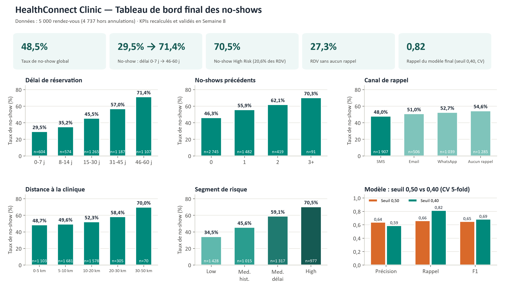

# HealthConnect Clinic — Appointment No-Show Analysis

**AnalystLab Africa Experience Lab | Data Analytics Track — Week 8 (Final)**
*(Continuity project — Weeks 4-8: problem understanding → analysis → validation → testing → final decision support)*

## 📌 Project Overview

HealthConnect Clinic is a fictional healthcare provider facing a significant operational challenge: a high rate of missed appointments (no-shows), which leads to inefficient use of appointment slots, repetitive administrative burden, and reduced quality of patient care.

**Central Project Question:** *How can HealthConnect Clinic use data and AI to reduce missed appointments and improve the patient support experience?*

This is a shared, multi-track Experience Lab project. The project progresses week by week:

| Week | Stage |
|---|---|
| Week 4 | Problem Understanding → Resource Review → Solution Planning |
| Week 5 | Analysis → Development → Initial Implementation |
| Week 6 | Integration → Advanced Development → Validation |
| Week 7 | Testing → Refinement → End-to-End Validation |
| **Week 8** | **Final Integration → Presentation** |

## 🗂️ Repository Structure

```
├── week4-kickoff/                              # Problem understanding
│   ├── Initial_Analysis_Document.pdf
│   └── Week4_Project_Summary.pdf
├── week5-analysis/                             # Cleaning, EDA, KPIs
│   ├── HealthConnect_Appointment_Data_cleaned.csv
│   ├── Initial_HealthConnect_Analytics_Report.pdf
│   └── Week5_Project_Summary.pdf
├── week6-advanced-development-validation/      # Chi² validation, risk segmentation, model artefact
│   ├── HealthConnect_Advanced_Analytics_Report.pdf
│   ├── HealthConnect_Feature_Validation_Model.py
│   └── Week6_Project_Summary.pdf
├── Week 7-testing-refinement/                  # KPI audit, anomaly test, threshold refinement
│   ├── HealthConnect_Analytics_Testing_Refinement_Report.pdf
│   ├── HealthConnect_Model_Testing_Refinement.py
│   └── Week7_Project_Summary.pdf
├── week8-final-integration/                    # Final decision-support package
│   ├── HealthConnect_Final_Analytics.py                             # Reproducible final run
│   ├── outputs/final_kpis.json                                      # Single source for every final figure
│   ├── figures/                                                     # Dashboard + 6 charts (PNG)
│   ├── HealthConnect_Final_Analytics_Decision_Support_Package.docx/.pdf
│   ├── HealthConnect_Final_Analytics_Presentation.pptx/.pdf         # 14 slides, native charts
│   └── Week8_Project_Summary.docx/.pdf
└── README.md
```

## 📊 Dataset

**File:** `HealthConnect_Appointment_Data.csv` (5,000 fictional, anonymized appointment records, 18 variables). The original file is never modified; a cleaned copy is maintained separately (`week5-analysis/HealthConnect_Appointment_Data_cleaned.csv`).

## 📈 Final Dashboard



## 🔍 Week 8 — Final Analytics & Decision Support (no new analysis)

| Final check | Result |
|---|---|
| **Final KPI confirmation** | Every dashboard KPI recomputed from the cleaned data — identical to Weeks 5-7 |
| **Threshold cross-validation** (Week 7 open item) | 5-fold stratified CV confirms 0.40 over 0.50: F1 **0.685 ± 0.006** vs 0.651 ± 0.010, recall **0.817** vs 0.662 |
| **Dashboard label validation** | The Week 7 "34.3% missed in Low Risk" was correct but mislabelled: its denominator is *all* Low Risk appointments. As a share of *true* no-shows the model misses **96.6%** (0.50) and still **67.8%** (0.40) — now labelled explicitly |
| **Operational load** (for Project Management) | At 0.40, 723 of every 1,000 appointments are flagged — too many for personal calls, hence a tiered protocol |
| **Reproducibility fix** | Week 6-7 scripts used an absolute path missing from the repo; the Week 8 script uses relative paths |

**Final validated patterns**

- Booking lead time is the #1 driver: **29.5% → 71.4%** no-show (0-7 vs 46-60 days, χ² p < 0.0001)
- Patient history is #2: **46.3% → 70.3%** (0 vs 3+ previous no-shows)
- **High Risk** segment (lead > 30 days AND ≥ 1 previous no-show): **20.6%** of appointments, **70.5%** no-show
- **27.3%** of appointments receive no reminder at all (54.6% no-show vs 48.0% with SMS)

## ✅ Final Recommendation — 3-tier reminder protocol (per 1,000 expected appointments)

| Tier | Who | Action | Volume |
|---|---|---|---|
| 1 — Enhanced | High Risk segment | Personal confirmation call + mid-lead reminder + SMS D-1 | ~206 |
| 2 — Monitored | Other appointments flagged by the model (p ≥ 0.40) | Double SMS (D-7 and D-1) | ~517 |
| 3 — Standard | Everyone else | Standard SMS D-1 — never zero reminders | ~277 |

Plus: SMS as default channel, a mid-lead touchpoint for bookings > 30 days, and an 8-week pilot with a control group before rollout. The model is used to **prioritise, never to exclude** a patient from reminders.

## 🔗 HC-POD Final Integration

Solo cohort: the Data Science role is self-assumed (as in Weeks 6-7). Outputs to the other tracks are delivered as documented hand-overs; no feedback was received from them, and this is stated rather than claimed.

| Flow | Final contribution | Status |
|---|---|---|
| Data Analytics ↔ Data Science | Validated features, segments, CV of the threshold / candidate model at 0.40 | Integrated & tested |
| Data Analytics → Project Management | Decision table, operational load, monitoring KPIs | Delivered — capacity confirmation pending |
| Data Analytics → ML Engineering | Final model input/output specification | Delivered — pipeline constraints pending |
| Data Analytics → Generative AI | Human-escalation rule for Tier 1 appointments | Delivered |

## ⚠️ Limitations

Correlational analysis (no causal proof) · fictional dataset (48% no-show vs 10-30% in practice) · moderate precision (~300 false alerts per 1,000 appointments) · weak coverage of the Low Risk segment · no temporal validation.

## ▶️ Reproduce

```bash
cd week8-final-integration
python HealthConnect_Final_Analytics.py   # regenerates outputs/final_kpis.json and figures/
```

## 🛠️ Tools & Techniques

- Python (pandas, matplotlib, scipy) — cleaning, KPIs, Chi² tests, Wilson confidence intervals
- scikit-learn — logistic regression, threshold refinement, stratified k-fold cross-validation
- Word / PowerPoint — final report and presentation

## 👤 Author

Josfrid AGBADOGBE, Data Analytics Intern, AnalystLab Africa Experience Lab
*Week 8 — HealthConnect Final Analytics, Dashboard & Business Insights*

#AnalystLabAfrica
